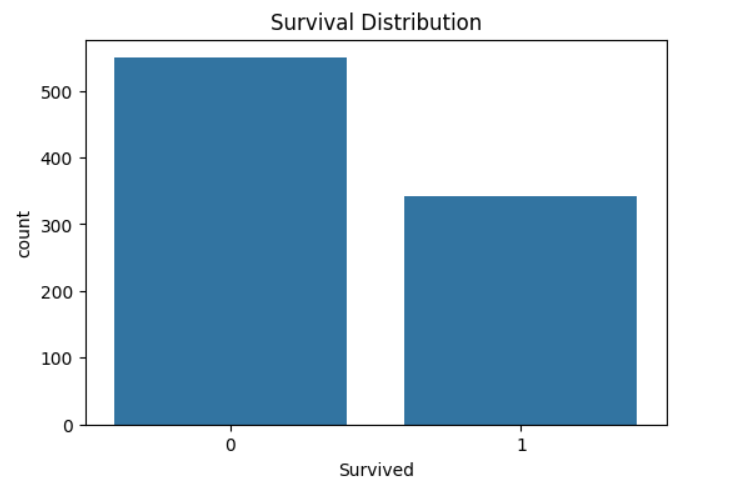
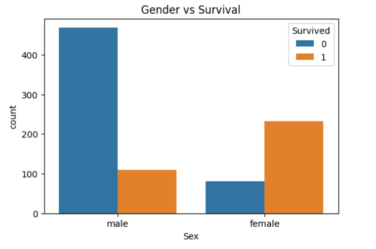
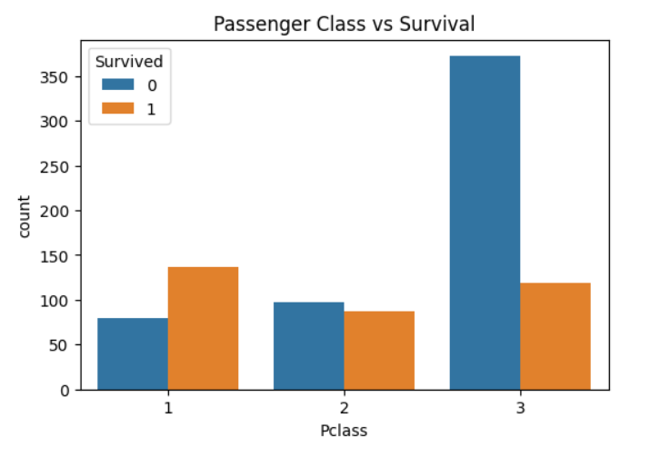
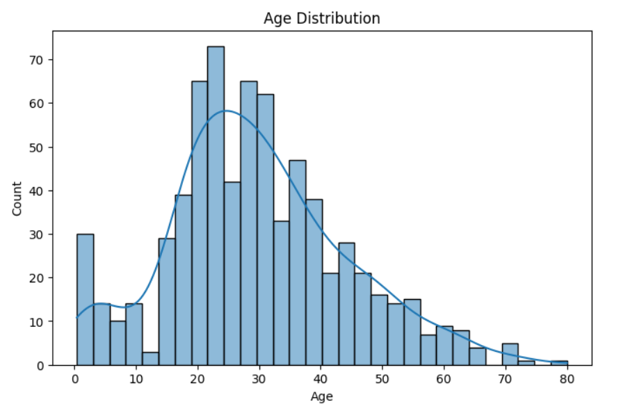
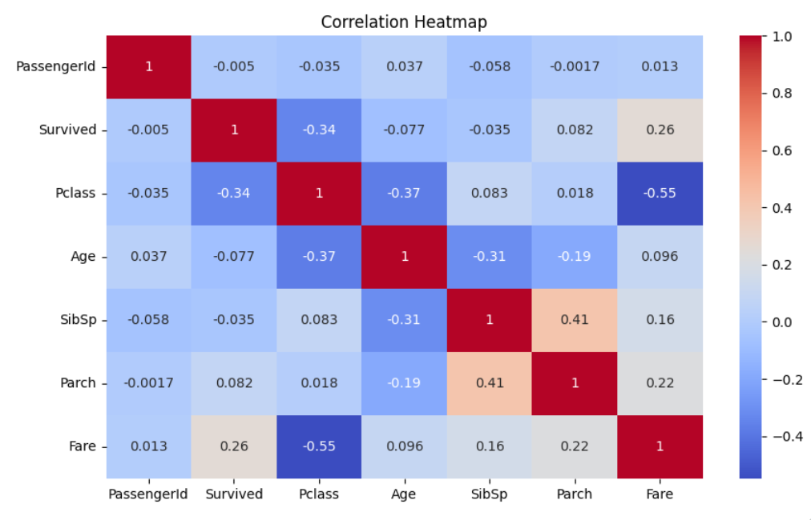
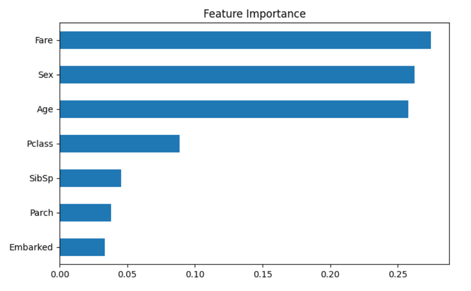
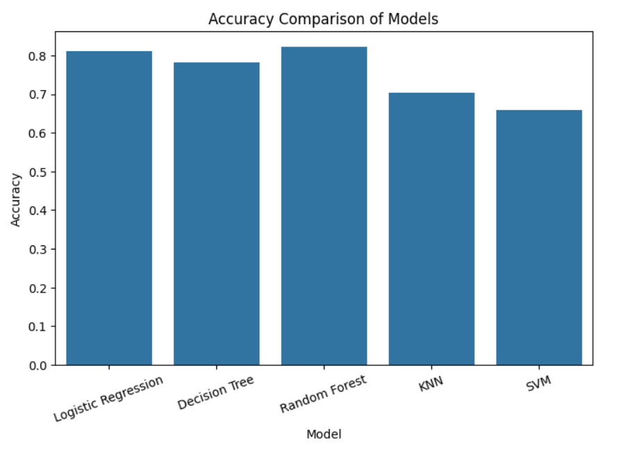
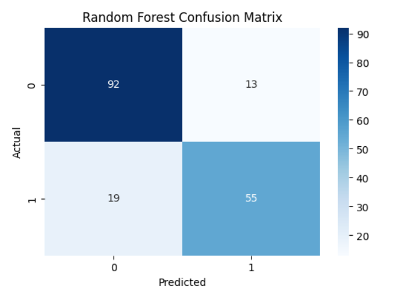

# 🚢 Titanic Survival Prediction using Machine Learning


## 📌 Project Overview

The Titanic Survival Prediction project aims to predict whether a passenger survived the Titanic disaster using machine learning techniques. The project involves data preprocessing, exploratory data analysis (EDA), feature engineering, model training, evaluation, and comparison of multiple classification algorithms.

By analyzing passenger information such as age, gender, ticket class, fare, and family relationships, machine learning models learn patterns associated with survival outcomes.

---

## 🎯 Objectives

- Load and explore the Titanic dataset.
- Perform data cleaning and preprocessing.
- Handle missing values effectively.
- Apply feature engineering techniques.
- Visualize important patterns through EDA.
- Train and compare multiple machine learning models.
- Evaluate model performance using standard metrics.
- Identify and analyze the best-performing model.

---

## 📂 Dataset Information

### Dataset Source

Titanic Dataset from Kaggle:

https://www.kaggle.com/c/titanic/data

### Dataset Features

| Feature | Description |
|----------|-------------|
| PassengerId | Unique passenger identifier |
| Survived | Target variable (0 = No, 1 = Yes) |
| Pclass | Passenger class |
| Name | Passenger name |
| Sex | Gender |
| Age | Passenger age |
| SibSp | Number of siblings/spouses aboard |
| Parch | Number of parents/children aboard |
| Ticket | Ticket number |
| Fare | Ticket fare |
| Cabin | Cabin number |
| Embarked | Port of embarkation |

### Dataset Size

- Total Records: **891**
- Total Features: **12**
- Target Variable: **Survived**

---

# 🔍 Exploratory Data Analysis (EDA)

Several visualizations were created to understand the dataset and identify important patterns.

### Survival Distribution



**Observation:** More passengers did not survive than survived.

---

### Gender vs Survival



**Observation:** Female passengers had significantly higher survival rates.

---

### Passenger Class vs Survival



**Observation:** First-class passengers had better survival chances.

---

### Age Distribution



**Observation:** Most passengers were between 20 and 40 years old.

---

### Correlation Heatmap



**Observation:** Passenger class, fare, and gender showed notable relationships with survival.

---

# ⚙️ Data Preprocessing

The following preprocessing steps were performed:

### Missing Value Handling

| Column | Action |
|----------|----------|
| Age | Filled using Median |
| Embarked | Filled using Mode |
| Cabin | Removed due to excessive missing values |

### Categorical Encoding

The following categorical variables were encoded:

- Sex
- Embarked

### Feature Selection

Removed columns:

- PassengerId
- Name
- Ticket

These features contributed little to predictive performance.

---

# 🛠 Feature Engineering

Feature engineering was performed to transform categorical variables into machine-readable formats and improve model performance.

### Feature Importance Analysis



### Most Important Features

- Sex
- Fare
- Pclass
- Age

These features contributed most to survival prediction.

---

# 🤖 Machine Learning Models

The following classification models were trained and evaluated:

| Model |
|---------|
| Logistic Regression |
| Decision Tree Classifier |
| Random Forest Classifier |
| K-Nearest Neighbors (KNN) |
| Support Vector Machine (SVM) |

---

# 📊 Model Evaluation Metrics

The following evaluation metrics were used:

- Accuracy
- Precision
- Recall
- F1 Score

---

# 📈 Model Performance Comparison

| Model | Accuracy | Precision | Recall | F1 Score |
|---------|---------|---------|---------|---------|
| Logistic Regression | XX | XX | XX | XX |
| Decision Tree | XX | XX | XX | XX |
| Random Forest | XX | XX | XX | XX |
| KNN | XX | XX | XX | XX |
| SVM | XX | XX | XX | XX |

> Replace XX values with your actual notebook results.

---

### Accuracy Comparison Chart



This visualization compares the performance of all trained models.

---

# 🏆 Best Model Analysis

After evaluating all models, the **Random Forest Classifier** achieved the best overall performance.

### Why Random Forest?

- Highest Accuracy Score
- Better Generalization
- Handles Feature Interactions Well
- Reduces Overfitting Compared to Decision Trees

---

## Confusion Matrix



The confusion matrix shows the number of correct and incorrect predictions made by the model.

---

## Classification Report

The classification report includes:

- Precision
- Recall
- F1 Score
- Support

and provides a detailed evaluation of the model's predictive capability.

---

# 🔄 Cross Validation Analysis

To validate model stability, 5-Fold Cross Validation was performed.

### Benefits

- Reduces bias from a single train-test split.
- Measures model consistency.
- Provides a more reliable estimate of real-world performance.

---

# 📋 Key Findings

- Female passengers had higher survival rates.
- First-class passengers had better survival chances.
- Passenger class and fare strongly influenced survival.
- Random Forest outperformed other classification models.
- Feature engineering improved prediction quality.

---

# 🚀 Technologies Used

- Python
- Pandas
- NumPy
- Matplotlib
- Seaborn
- Scikit-Learn
- Google Colab
- GitHub

---

# 📁 Project Structure

```text
Titanic-Survival-Prediction
│
├── Titanic_Survival_Prediction.ipynb
├── README.md
├── images
│   ├── survival_distribution.png
│   ├── gender_vs_survival.png
│   ├── class_vs_survival.png
│   ├── age_distribution.png
│   ├── correlation_heatmap.png
│   ├── feature_importance.png
│   ├── model_comparison.png
│   └── confusion_matrix.png
```

---

# ✅ Conclusion

This project successfully implemented an end-to-end machine learning workflow for Titanic survival prediction. Data preprocessing, feature engineering, exploratory data analysis, and model comparison were performed using five classification algorithms.

Among all trained models, the **Random Forest Classifier** achieved the best performance and was selected as the final model for predicting passenger survival.

---

# 👩‍💻 Author

**Varshitha Ruttala**

Machine Learning Internship Project

Titanic Survival Prediction
